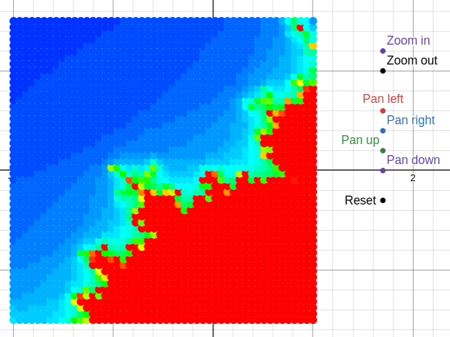
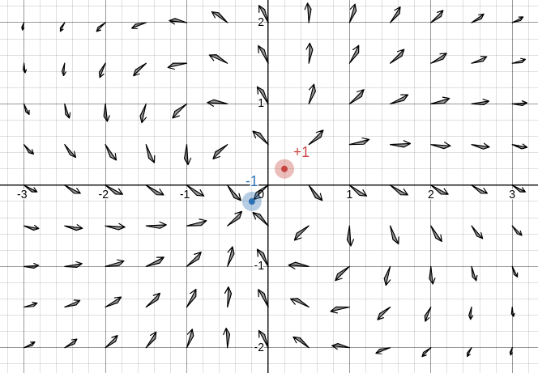

# desmos.py

Build interactive [Desmos](https://desmos.com) graphs from Python.

Write your math in idiomatic Python with tuples, attribute access, list comprehensions, ternaries, recursive iteration. `desmos.py` compiles it to a Desmos state JSON and embeds it in a self-contained HTML page that runs entirely client-side.

You can find a demo with a Mandelbrot explorer ([`examples/mandelbrot.py`](examples/mandelbrot.py)) built in ~40 lines of Python.



---

## Installation

```bash
pip install desmosdotpy
```

For development:

```bash
git clone https://github.com/chris-zy-liu/desmos.py
cd desmos.py
pip install -e ".[dev]"
pytest
```

---

## Quickstart

```python
from desmos import Graph

g = Graph(bounds=(-10, 10, -10, 10))

a = g.slider("a", -5, 5, value=1, step=0.1)   # interactive slider
g.expr(r"y = a x^{2}", color="#c74440")        # raw Desmos LaTeX

g.to_html("parabola.html")
```

Open `parabola.html` in a browser. Drag the slider — the curve updates.

---

## Concepts

### `Graph`

The top-level builder. Holds the viewport, an ordered list of expressions, and the ticker (if any).

```python
g = Graph(
    bounds=(xmin, xmax, ymin, ymax),
    title="My Graph",          # HTML <title>
)
```

### Expressions

Every visible or hidden element in a Desmos graph is an "expression". You add them through helper methods on the `Graph` object. The primary ones:

| Method                                                         | What it does                                   |
| -------------------------------------------------------------- | ---------------------------------------------- |
| `g.expr(latex, **style)`                                       | Add a raw-LaTeX expression. Escape hatch.      |
| `g.var(name, value)`                                           | Hidden variable: `name = value`                |
| `g.slider(name, min, max, value, step)`                        | Variable with a slider UI                      |
| `g.circle`, `g.rectangle`, `g.point`, `g.line`, `g.arrow`, `g.text` | Geometric primitives                      |
| `g.button(text, at=(x,y), action=...)`                         | Clickable point that runs an action            |
| `g.ticker(action, rate_ms=30)`                                 | Action that runs continuously                  |
| `@g.func`                                                      | Compile a Python function to a Desmos function |
| `g.iterate(step, x0, name=..., extra_params=[...])`            | Recursive iteration                            |
| `g.heatmap(value_fn, x_range=..., y_range=..., max_value=...)` | Coloured point grid                            |
| `g.field(Ex_fn, Ey_fn, x_range=..., y_range=...)`              | Vector field arrows (live, vectorised)         |

### Output

```python
g.to_html("out.html")     # write self-contained HTML
g.to_state_json()         # return the Desmos state as a JSON string
g.to_state()              # return the state as a dict (for inspection / tests)
```

---

## Variables and sliders

```python
N    = g.slider("N", 10, 100, value=40, step=1)
zoom = g.var("zm", 1.5)
```

Both return a `Var` object that:

1. Knows its Desmos name (e.g. `z_{oom}` — see [Identifier naming](#identifier-naming)).
2. Supports arithmetic — `zoom * 0.5`, `N + 1`, `-zoom` — by building LaTeX expression trees lazily. This is **not** a general expression DSL (for that see `@g.func`); it's just enough to write button actions naturally.

```python
zoom * 0.5    # builds LaTeX: z_{m} \cdot 0.5
N + 1         # builds LaTeX: N + 1
```

---

## Actions and buttons

A Desmos *action* is an assignment that runs on demand:

```python
zoom.set(zoom * 0.5)   # action: zm -> zm * 0.5
```

Bind it to a button:

```python
g.button("Zoom in", at=(5, 5), action=zoom.set(zoom * 0.5))
```

Pass a **list** to sequence multiple assignments atomically:

```python
g.button("Reset", at=(5, 4), action=[
    cx.set(0),
    cy.set(0),
    zoom.set(1),
])
```

A *ticker* runs an action continuously at a fixed rate:

```python
t = g.var("t", 0.0)
g.ticker(t.set(t + 0.016), rate_ms=16)   # 60 Hz time counter
```

---

## Geometric primitives

Every primitive returns an `Expression` whose style attributes you can mutate after the fact.

```python
# Circle
g.circle((0, 0), radius=1, color="#2d70b3")
g.circle((cx, cy), radius=r, line_style="DASHED")   # parameterised on Vars

# Rectangle (filled)
g.rectangle((-2, -1), width=4, height=2,
            color="#c74440", fill_opacity=0.3)

# Draggable point
p = g.point((1, 1), draggable="XY", color="#fa7e19", label="drag me")

# Line segment
g.line((0, 0), (3, 4), line_width=3)

# Arrow with filled triangle head (static endpoints — head geometry is
# precomputed in Python; for dynamic vector fields use vectorised polygons)
g.arrow((0, 0), (1, 1), color="#000000", head_size=0.15)

# Text label
g.text("Origin", (0, 0))
```

The position / radius / size arguments can be plain numbers **or** `Var` / `LatexExpr` instances — in which case the shape updates whenever the underlying variable changes.

---

## `@g.func` — Python compiled to Desmos

The decorator reads the function's source with `inspect.getsource`, parses it into a Python AST, and emits Desmos LaTeX:

```python
@g.func
def step(z, c):
    return (z.x ** 2 - z.y ** 2 + c.x,  2 * z.x * z.y + c.y)
```

becomes (roughly):

```
step(z, c) = ((z.x)^2 - (z.y)^2 + c.x,  2·z.x·z.y + c.y)
```

Note that a Python 2-tuple translates to a Desmos *point*, with `.x` / `.y` accessors.
### Supported subset (v1, strict)

| Python | Desmos |
|---|---|
| `a + b`, `a - b`, `a * b`, `a % b` | `a + b`, etc. (`%` → `\operatorname{mod}`) |
| `a / b` | `\frac{a}{b}` |
| `a ** b` | `a^{b}` |
| `-a`, `+a` | unary `-a`, `+a` |
| `a < b`, `<=`, `>`, `>=`, `==`, `!=` | corresponding LaTeX |
| `a < b < c` | piecewise condition `{a<b, b<c}` |
| `a if cond else b` | piecewise `{cond: a, b}` |
| `f(x, y)` | `f(x, y)` (user funcs) or builtin |
| `(x, y)` | Desmos point `(x, y)` |
| `(x, y, z)`, `[x, y, z]` | Desmos list `[x, y, z]` |
| `p.x`, `p.y` | point component access |
| `a[i]` | `a[i + 1]` (Python 0-based → Desmos 1-based, auto-converted) |
| `[expr for k in iter]` | `[expr for k = iter]` |
| `range(n)` | `[1...n]` |
| `range(a, b)` | `[a...b]` |

**Built-in functions** mapped to Desmos equivalents:

`abs`, `sqrt`, `sin`, `cos`, `tan`, `exp`, `log` / `ln`, `floor`, `ceil`, `round`, `min`, `max`, `sum` (→ `\operatorname{total}`), `len` (→ `\operatorname{length}`).

### Explicitly rejected (raises `DesmosTranslationError`)

`for` / `while` loops, `if` statements (use ternary), mid-function assignments, `lambda`, generator expressions, list comprehensions with `if` filters or multiple generators, `*args` / `**kwargs`, keyword arguments, f-strings. The error always reports the offending line number.

### Why so strict?

Desmos's evaluation model is purely functional. It does not allow mutation. The translator stays within constructs that map cleanly. If you hit a limitation, you can always drop down to `g.expr(r"...")` and write raw LaTeX.

---

## `g.iterate` — recursive iteration

Desmos doesn't allow recursion inside arrow expressions, but it **does** allow recursive function definitions via piecewise base cases. `g.iterate` emits one:

```python
orbit = g.iterate(step, x0=(0, 0), name="orbit", extra_params=["c"])
```

becomes:

```
orbit(k, c) = { k = 0 : (0, 0),  step(orbit(k-1, c), c) }
```

Read: "orbit at iteration k is `(0, 0)` if k=0, otherwise one `step` applied to the previous orbit value, threading `c` through unchanged."

- `step` is a `LatexExpr` returned by an `@g.func`-decorated function.
- The first argument of `step` is the iterated state.
- `extra_params` lists names passed through unchanged on each recursion.
- Returns a `LatexExpr` for the new function so you can reference it in
  other `@g.func` bodies.

---

## `g.heatmap` — colored pixel grid

```python
g.heatmap(
    value_fn,                                  # @g.func returning a number
    x_range=(cx - zm, cx + zm, RES),           # math region (may be Vars)
    y_range=(cy - zm, cy + zm, RES),
    max_value=N,                               # value_fn's normaliser
    palette="fire",                            # "fire" or "grayscale"
    point_size=12,
    display_bounds=(-2, 1, -1.5, 1.5),         # optional: where pixels live
)
```

Two grids are emitted internally:

- **Math grid** — at `x_range` × `y_range`. Follows pan/zoom variables.
  Sampled by `value_fn`.
- **Display grid** — at `display_bounds` (defaults to the viewport). Static.
  This is where pixels are *drawn*.

The separation is what makes zoom work properly: shrink the math region and
the pixel positions stay put, so the picture magnifies instead of compressing
into a smaller patch.

The color for each pixel is `hsv(240·(1 − value/max_value), 1, 1)` for the
fire palette — blue at low values, red at high.

---

## `g.field` — live vector field

```python
g.field(
    Ex_fn, Ey_fn,                # @g.func returning x and y components
    x_range=(xmin, xmax, n),     # n = count (int) or stride (float)
    y_range=(ymin, ymax, n),
    length=0.25,                 # shaft length (every arrow is direction-only)
    head_size=0.08,              # length of each V-head wing
    color="#000000",
    line_width=1.2,
    name="f",                    # identifier prefix; change if you want two fields
)
```

The arrow geometry is built entirely as vectorised Desmos LaTeX, so the field
updates live whenever its inputs change — drag a charge, move a slider, etc.
For single static arrows (Python-precomputed head) use `g.arrow` instead.

---

## Worked example: Mandelbrot explorer

See [`examples/mandelbrot.py`](examples/mandelbrot.py) for the full file. The
shape:

```python
from desmos import Graph

g = Graph(bounds=(-2, 2.5, -1.5, 1.5))
RES = 50

N  = g.slider("N",  10, 100, value=40, step=1)
cx = g.var("cx", -0.5);  cy = g.var("cy", 0.0);  zm = g.var("zm", 1.5)

@g.func
def step(z, c):
    return (z.x**2 - z.y**2 + c.x,  2*z.x*z.y + c.y)

@g.func
def magsq(z):
    return z.x**2 + z.y**2

orbit = g.iterate(step, (0, 0), name="orbit", extra_params=["c"])

@g.func
def inside(k, c):
    return 1 if magsq(orbit(k, c)) < 4 else 0

@g.func
def escape(c):
    return sum([inside(k, c) for k in range(N)])

g.heatmap(escape,
          x_range=(cx - zm, cx + zm, RES),
          y_range=(cy - zm, cy + zm, RES),
          max_value=N,
          display_bounds=(-2, 1, -1.5, 1.5))

g.button("Zoom in", at=( 1.7, 1.2), action=zm.set(zm * 0.5))
g.button("Zoom out", at=( 1.7, 1.0), action=zm.set(zm * 2.0))
g.button("Pan left", at=( 1.7, 0.6), action=cx.set(cx - zm * 0.3))
g.button("Pan right", at=( 1.7, 0.4), action=cx.set(cx + zm * 0.3))
g.button("Pan up", at=( 1.7, 0.2), action=cy.set(cy + zm * 0.3))
g.button("Pan down", at=( 1.7, 0.0), action=cy.set(cy - zm * 0.3))
g.button("Reset", at=( 1.7, -0.3), action=[
	cx.set(-0.5),
	cy.set(0.0), 
	zm.set(1.5)
])

g.to_html("mandelbrot.html")
```

That's it — a fully interactive Mandelbrot explorer compiled to a single HTML file. The grid resolution × iteration depth is the perf knob (50×50 × 40 iters ≈ 100K evaluations per redraw).

---

## Worked example: electric field of two charges

See [`examples/electric_field.py`](examples/electric_field.py) for the full file. Two draggable point charges (`+1` red, `-1` blue) and a 13×9 grid of arrows showing the field direction. Drag either charge to watch the field redraw.



Most of the work goes into the field equations; the arrows themselves are one call to `g.field`:

```python
# Two draggable charges, as raw expressions.
g.expr(r"P_{1}=(-1, 0)", drag_mode="XY", point_size="20", color="#c74440")
g.expr(r"P_{2}=( 1, 0)", drag_mode="XY", point_size="20", color="#2d70b3")

@g.func
def Exfrom(p, q, src):
    return q * (p.x - src.x) / ((p.x - src.x)**2 + (p.y - src.y)**2 + 0.02)**1.5
# Eyfrom defined symmetrically

@g.func
def Ex(p): return Exfrom(p, 1, P1) + Exfrom(p, -1, P2)
@g.func
def Ey(p): return Eyfrom(p, 1, P1) + Eyfrom(p, -1, P2)

g.field(Ex, Ey,
        x_range=(-3, 3, 13),  # (min, max, count)
        y_range=(-2, 2, 9),
        length=0.25, head_size=0.08)
```

`P1` and `P2` are *Desmos* identifiers — they're undefined Python names, but the translator only needs them to compile to LaTeX (auto-subscripted to `P_{1}`, `P_{2}`). A `+0.02` softening term in the denominator avoids the singularity at the charges themselves.

Under the hood, `g.field` emits four helper functions (`mag`, `tip`, `wingL`, `wingR`), three parallel point lists (`T`, `L`, `R`), and one vectorised polygon call `polygon(G, T, L, T, R)`. That last call is the key trick: Desmos's `polygon(L1, ..., Lk)` with `k` equal-length point lists produces N `k`-vertex polylines — here 5 vertices per arrow tracing `tail → tip → wingL → tip → wingR`, drawing the shaft and V-head as one self-intersecting polyline per grid point. The whole field redraws in one pass when you drag a charge.

---
## Identifier naming

Desmos parses bare multi-character names as products: `zoom` would mean `z · o · o · m`. To avoid this, `desmos.py` automatically subscripts:

- `g.var("zoom", ...)` → Desmos variable `z_{oom}`
- `g.var("cx", ...)` → `c_{x}`
- `@g.func def escape(...)` → Desmos function `\operatorname{escape}`
- Single-character names like `g.var("a", ...)` pass through unchanged.

You can opt out by including a `_` or `\` in the name, in which case the name is passed through verbatim: `g.var("a_1", 0)` → `a_1`.

---

## Output

```python
g.to_html("path.html")     # writes a self-contained HTML page
g.to_state_json()          # the underlying Desmos state, as JSON
g.to_state()               # same, as a Python dict
```

The HTML loads Desmos via their public Calculator API on a demo API key. That key works on any domain for non-commercial use. For production deployment, request your own key from desmos.com/api and edit `desmos/template.html`.

---

## Examples

```bash
python examples/quickstart.py        # parabola with a slider
python examples/geometry.py          # circles, rectangles, points, lines, arrows, text
python examples/electric_field.py    # two charges + live vector field
python examples/mandelbrot.py        # the showcase
```

Each writes an `.html` file in the current directory. Open it in any browser.

---

## Tests

```bash
pytest
```

37 golden-file tests for the AST translator currently. All pass on Python
3.10–3.14.

---

## Roadmap

Not yet implemented but designed-for:

- **Live server mode** — `g.serve()` with a websocket bridge so Python
  callbacks can fire on button clicks / slider changes.
- **Operator-overloaded expression DSL** — symbol objects so simple math
  doesn't require `@g.func`.
- **Translator extensions** — `for`-loop unrolling, simple assignment
  inlining, `enumerate`, filtered comprehensions.
- **Jupyter / Colab integration** — `_repr_html_` so graphs render inline.
- **Animation primitives** — `g.animate(var, keyframes)` sugar over tickers.

---

## License

MIT. See [LICENSE](LICENSE).

